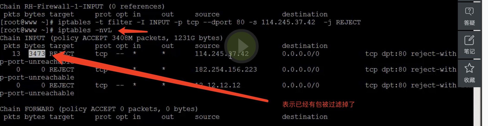
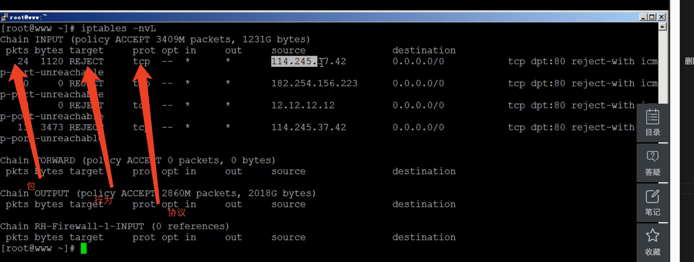

## Selinux
* 美国国家安全局一起开发的一个安全模块
* 日常工作不用，带来了很大的管理成本
* 能用最好，用不好会很麻烦
* 如果你很熟悉可以研究一下

**如果关闭selinux**

```
getenforce 查看状态
cat /etc/selinux/config   看注释了解配置
```

**SELINUX = **
* enforceing
* permissive
* disabled 

```
可以改配置文件永久禁用，也可以临时禁用 getenforce 可以得到状态
setenforce 0 可以不重启，临时关掉
如果getenforce 没有这个命令 就要安装一个包

rpm -qf `which setenforce`

libselinux-utils-1.33.4-5.7.e15

注意：selinux不是服务，不能直接 service selinux reload
```

## 2.0 iptables详解-1
* 名字叫 netfilter, iptables 只是命令的名字
* table --> chain --> rule

```
iptables -t filter -nvL  查看表 t指定表名字  -nvl 查看表下的规则
iptables -t nat -nvL     nat 表
iptables -t mangle -nvL   mangle 表
```

**用最多的就是filter表**

```
filter的作用
用来过滤包，进包，出包过滤

filter  INPUT  OUTPUT

chain: INPUT FORWARD OUTPUT

iptables -t filter -I INPUT -p tcp --dport 80 -s 12.12.12.12 -j DROP
iptables -t filter -D INPUT -p tcp --dport 80 -s 12.12.12.12 -j DROP    D就是delete I就是input  删除和增加一条规则 A 就是add增加一条规则

-I 徽增加到表上头  -A会增加到表后面

规则 /DROP/REJECT
iptables -nvL  默认就是显示filter表
```



## 2.1 iptables详解-2
* DROP  直接把包扔了
* REJECT  包拿回来看看再拒绝
* ACCEPT

三种行为

* 第一条 规则允许了 后面的规则你再拦截也没有用了
* iptables -Z   zero 重置pkgs为0
* iptables -F  把规则全部清空   因为没特别指定一个表 这个全部都是用filtetr表

```
如果修改了规则不保存的话 再reload 规则就会被重置
service iptables save  永久保存iptables

iptables-save > 1.ipt 吧规则保存到这  备份防火墙规则
iptables -F 
iptables -nvL
iptables-restore < 1.ipt  先清楚规则 再恢复
```

## 2.2 iptables详解-3
* filter nat  mangle  三个表
* nat表主要用于网络地址转换

```
iptables -t nat -nvL
NAT表就像路由器
1台路由器出口的公网IP只有一个，但是内网里面可以有成白上千个IP

我的公网IP  114.245.37.42  私网IP 192.168.*.*  私网IP不能在公网通信

过程，一个私网IP要请求公司资源的时候，是路由的公网IP带它请求的，路由器拿到数据之后再转发给这个请求的私网IP

网关其实就是路由器

prerouting 进来的包

postrouting 出去的包  包就要离开防火墙的时候把包的原地址改一下

filter表主要用来限制进入本机的包和出去的包

nat表主要用于网络地址转换

mangle表主要用来给包打标记

INPUT是针对进来的数据包，OUTPUT是针对出去的数据包

iptables -t mangle -nvL
五条chain
主要是给数据包打标记，然后操作
阿铭从来没碰过这张表
```


## 2.3 iptables详解-4

* iptables -P INPUT DROP       policy-->chain的总开关 默认的策略

**example**

* INPUT DROP;  192.168.0.0/24 22 accept ;  all 80 accept;  all 21 accept

```
#!/bin/bash
ipt="/sbin/iptables"
$ipt -F
$ipt -P INPUT DROP
$ipt -P OUTPUT ACCEPT
$ipt -P FORWARD ACCEPT

$ipt -A INPUT -s 192.168.0.0/24 -p tcp --dport 22 -j ACCEPT
%ipt -A INPUT -p tcp --dport 80 -j ACCEPT
$ipt -A INPUT -p tcp --dport 21 -j ACCEPT
```


## 扩展
* http://ask.apelearn.com/question/1003
* http://ask.apelearn.com/question/3624
* 谷歌‘端口映射’